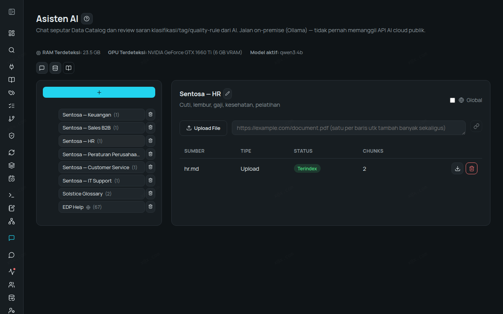
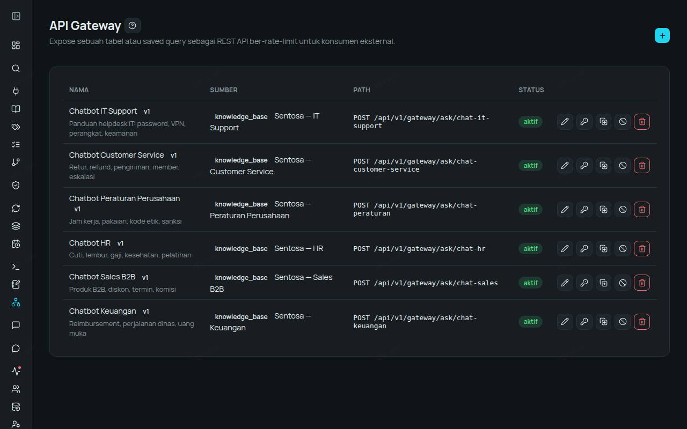
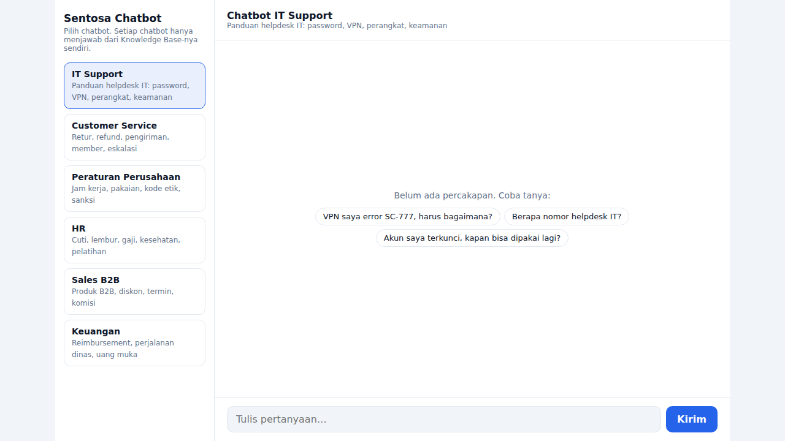
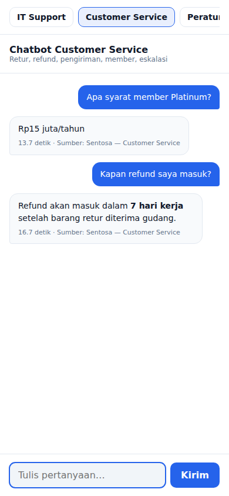
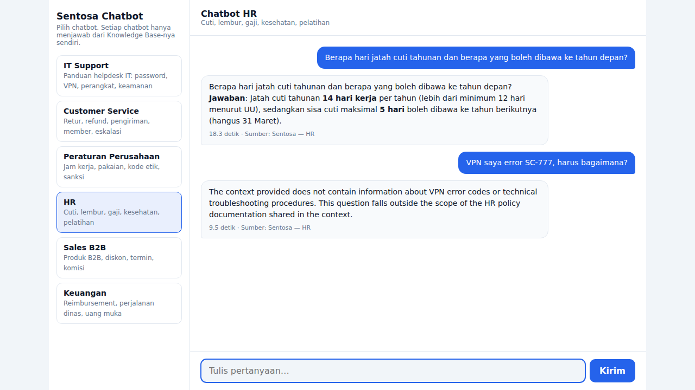

# Walkthrough — Satu Platform, Enam Chatbot Perusahaan (IT Support, Customer Service, Peraturan, HR, Sales, Keuangan)

Cara mudah membuat chatbot custom untuk perusahaan dengan Enterprise Data Platform: unggah dokumen
internal ke **Knowledge Base**, publikasikan sebagai **chat API** lewat **API Gateway**, lalu pasang
halaman chat sederhana. Setiap chatbot hanya menjawab dari dokumennya sendiri, dan semua AI berjalan
**on-premise** (Ollama `qwen3:4b`, GPU konsumen 6 GB). Tidak ada dokumen atau pertanyaan yang
dikirim ke layanan AI publik.

Semua jawaban dan waktu respons di bawah adalah hasil run nyata, bukan contoh karangan.

## Skenario

**PT Sentosa Retail Group** (fiktif) ingin karyawan dan pelanggan berhenti bertanya hal yang sama
berulang-ulang lewat chat pribadi. Setiap divisi punya dokumen panduannya sendiri:

| Chatbot | Dokumen | Contoh isi |
|---|---|---|
| IT Support | `kb/it-support.md` | helpdesk ext. 4357, kode error VPN SC-401/503/777 |
| Customer Service | `kb/customer-service.md` | retur 14 hari, refund 7 hari kerja, member Platinum |
| Peraturan Perusahaan | `kb/peraturan-perusahaan.md` | WFH 2 hari/minggu, hadiah pemasok maks. Rp500.000, SP1–SP3 |
| HR | `kb/hr.md` | cuti 14 hari, carry-over 5 hari, cuti ayah 5 hari |
| Sales B2B | `kb/sales.md` | matriks persetujuan diskon, komisi 2% |
| Keuangan | `kb/keuangan.md` | per diem luar Jawa Rp500.000, uang muka 7 hari kerja |

Semua angka dan istilah di dokumen (SentosaConnect, SC-777, ext. 4357, dst.) **dikarang** — model AI
tidak mungkin tahu dari pengetahuan umum. Kalau jawabannya tepat, berarti ia membaca dokumen Anda.

## Langkah 1 — Buat Knowledge Base per Divisi (±1 menit per KB)

1. Buka **AI Assistant → Knowledge Base → New Knowledge Base**, beri nama mis. `Sentosa — HR`.
2. Unggah dokumennya (PDF, Word, Markdown, teks, atau tambahkan dari URL).
3. Tunggu status dokumen **indexed**.

Hasil nyata: 6 KB, masing-masing 1 dokumen, ter-index 2–3 chunk dalam **3–9 detik** per dokumen.



> Satu KB per divisi itu penting: chatbot HR tidak boleh menjawab dari dokumen Keuangan, dan
> sebaliknya. Satu KB juga bisa berisi banyak dokumen.

## Langkah 2 — Publikasikan Setiap KB sebagai Chat API

1. Buka **API Gateway → + New Route**.
2. Source: **Knowledge Base**, pilih KB-nya (mis. `Sentosa — HR`), path `chat-hr`.
3. Klik **Generate Key**. API key hanya tampil sekali, simpan baik-baik.
4. Ulangi untuk 5 KB lain (`chat-it-support`, `chat-customer-service`, `chat-peraturan`,
   `chat-sales`, `chat-keuangan`).

Setiap route punya API key sendiri, rate limit sendiri, dan bisa dicabut kapan saja tanpa
mengganggu chatbot lain. Setiap pertanyaan tercatat di **Audit Log**.



Cara memanggilnya dari aplikasi apa pun:

```bash
curl -X POST https://<domain-gateway-anda>/api/v1/gateway/ask/chat-hr \
  -H "apikey: <API key>" -H "Content-Type: application/json" \
  -d '{"question": "Cuti ayah berapa hari?"}'
```

Balasan: `{"answer": "...", "sources": [{"label": "Sentosa — HR", ...}]}`.

## Langkah 3 — Halaman Chat Sederhana (folder `chat-app/`)

Dua file saja, tanpa framework dan tanpa `pip install`:

- `index.html` — daftar chatbot di kiri, percakapan di kanan, contoh pertanyaan per chatbot,
  sumber dokumen dan waktu respons di bawah setiap jawaban. Tampilan menyesuaikan HP.
- `server.py` — server kecil (Python standar) yang menyajikan halaman dan meneruskan pertanyaan ke
  API Gateway. **API key tetap di server**, tidak pernah dikirim ke browser karyawan/pelanggan.

```bash
cd chat-app
cp config.example.json config.json   # isi gateway_url + 1 entri per chatbot (path + API key)
python3 server.py                    # lalu buka port 8765 di browser
```

Mau chatbot ke-7 (mis. Legal)? Buat KB + route baru, tambahkan satu entri di `config.json`.





## Hasil — Tanya Jawab Nyata

Semua pertanyaan dikirim lewat `chat-app` → API Gateway → Knowledge Base → AI on-premise.
Waktu = total sampai jawaban tampil.

**IT Support**

- *"VPN saya error SC-777, harus bagaimana?"* (29 detik)
  > Error **SC-777** terjadi karena sertifikat perangkat kedaluwarsa. Anda harus membawa laptop ke
  > meja IT lantai 3 untuk diperbarui (tidak bisa dilakukan dari jarak jauh).
- *"Berapa nomor helpdesk IT dan jam layanannya?"* (33 detik)
  > Nomor helpdesk IT adalah ekstensi **4357** (H-E-L-P) dengan jam layanan Senin–Jumat
  > 07.00–20.00 dan Sabtu 08.00–14.00.

**Customer Service**

- *"Berapa lama batas retur barang dan kapan refund saya masuk?"* (19 detik)
  > Batas retur barang adalah **14 hari** sejak barang diterima (dengan struk atau nomor pesanan).
  > Refund masuk dalam **7 hari kerja** setelah barang retur diterima gudang.
- *"Apa syarat member Platinum?"* (18 detik)
  > Syarat menjadi member Platinum adalah belanja minimal Rp15 juta per tahun.

**Peraturan Perusahaan**

- *"Boleh WFH berapa hari seminggu?"* (21 detik)
  > 2 hari per minggu
- *"Bolehkah saya menerima hadiah dari pemasok?"* (36 detik)
  > Tidak, Anda tidak boleh menerima hadiah dari pemasok bernilai lebih dari Rp500.000. Hadiah di
  > atas nilai tersebut wajib dilaporkan ke tim Kepatuhan dalam 3 hari kerja.

**HR**

- *"Berapa hari jatah cuti tahunan dan berapa yang boleh dibawa ke tahun depan?"* (18 detik)
  > Jatah cuti tahunan adalah **14 hari kerja**, dan maksimal **5 hari** boleh dibawa ke tahun
  > berikutnya.
- *"Cuti ayah berapa hari?"* (22 detik)
  > Cuti ayah berjumlah **5 hari kerja**.

**Sales B2B**

- *"Siapa yang harus menyetujui diskon 12%?"* (19 detik)
  > Head of Sales
- *"Berapa komisi sales dan kapan dibayar?"* (15 detik)
  > Komisi sales adalah **2%** dari nilai penjualan yang sudah lunas dan dibayar bersama gaji bulan
  > berikutnya.

**Keuangan**

- *"Berapa uang harian perjalanan dinas ke Makassar?"* (16 detik)
  > Uang harian perjalanan dinas ke Makassar adalah **Rp500.000** (di luar Pulau Jawa).

  Dokumen tidak menyebut Makassar, hanya "di luar Jawa". AI menyimpulkannya sendiri dengan benar.
- *"Kapan uang muka kerja harus dipertanggungjawabkan?"* (29 detik)
  > 7 hari kerja setelah kegiatan selesai

## Uji Batas — Chatbot HR Ditanya Soal VPN

Pertanyaan IT dikirim ke chatbot **HR**. Chatbot HR tidak punya akses ke dokumen IT, jadi ia harus
menolak, bukan mengarang (12 detik):




> The context provided does not contain any information about VPN error codes, technical support,
> or network-related issues. This query falls outside the scope of the HR policies and employee
> benefits documentation shared in the context. Please contact your organization's IT support team
> for assistance.

Isolasi antar-chatbot berjalan: tidak ada jawaban karangan, dan ia mengarahkan ke tim IT.
Catatan jujur: penolakan ini keluar dalam bahasa Inggris walau pertanyaannya berbahasa Indonesia.
Model kecil (4B) kadang mengabaikan instruksi bahasa saat konteksnya tidak relevan; model yang
lebih besar lebih konsisten.

## Waktu Respons (Jujur)

- 11–36 detik per jawaban di GPU konsumen 6 GB (GTX 1660 Ti), model `qwen3:4b`.
- GPU server (mis. kelas L4/A10) memangkas waktu ini jauh, tanpa mengubah apa pun di sisi chatbot.
- Untuk chatbot pelanggan yang butuh jawaban instan, matikan mode *Thinking* di **Admin → AI
  Settings** atau gunakan GPU yang lebih besar.

## Ringkasan

| Kebutuhan | Fitur |
|---|---|
| Chatbot menjawab dari dokumen internal | Knowledge Base (RAG) |
| Satu chatbot per divisi, tidak saling bocor | 1 KB + 1 route per chatbot |
| Dipakai aplikasi lain (web, WhatsApp, intranet) | API Gateway: chat API + API key |
| Tahu siapa bertanya apa | Audit Log |
| Data tidak keluar dari perusahaan | AI on-premise (Ollama) |

## File

- `kb/` — enam dokumen fiktif PT Sentosa, siap diunggah ke Knowledge Base.
- `chat-app/` — `index.html`, `server.py`, dan `config.example.json` (salin jadi `config.json`).

## Coba Sendiri

- Trial gratis 14 hari, tanpa sales call: https://alzizan.co.id/register
- Demo video: https://www.youtube.com/@AlzizanDigitalSolutions

---

Konten repo ini dilisensikan [CC BY 4.0](LICENSE). © PT Alzizan Digital Solutions.
